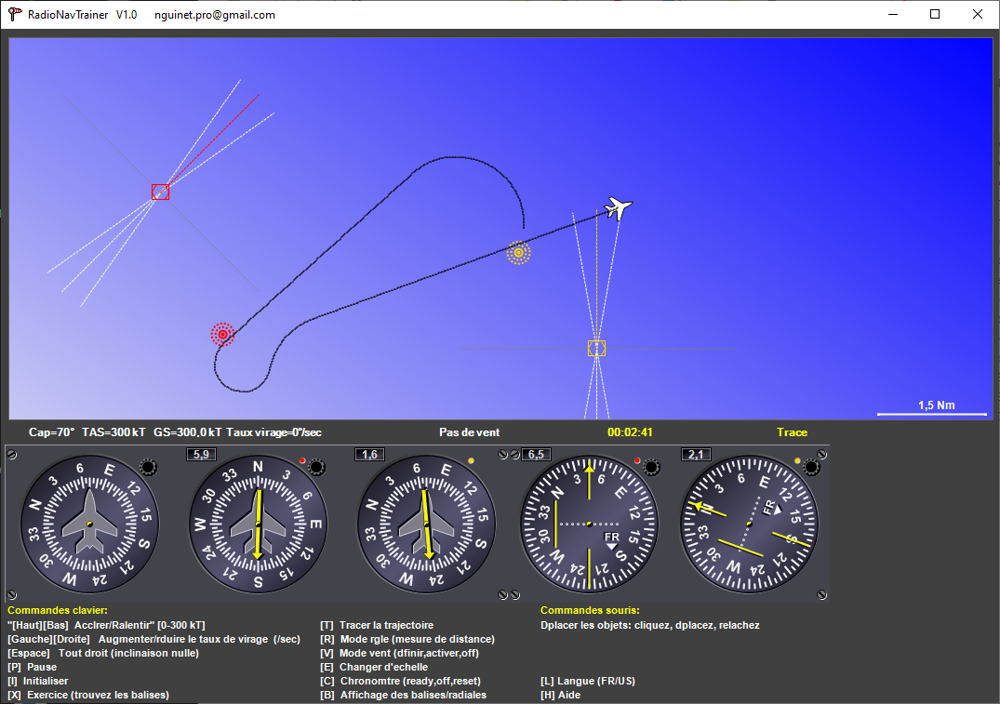
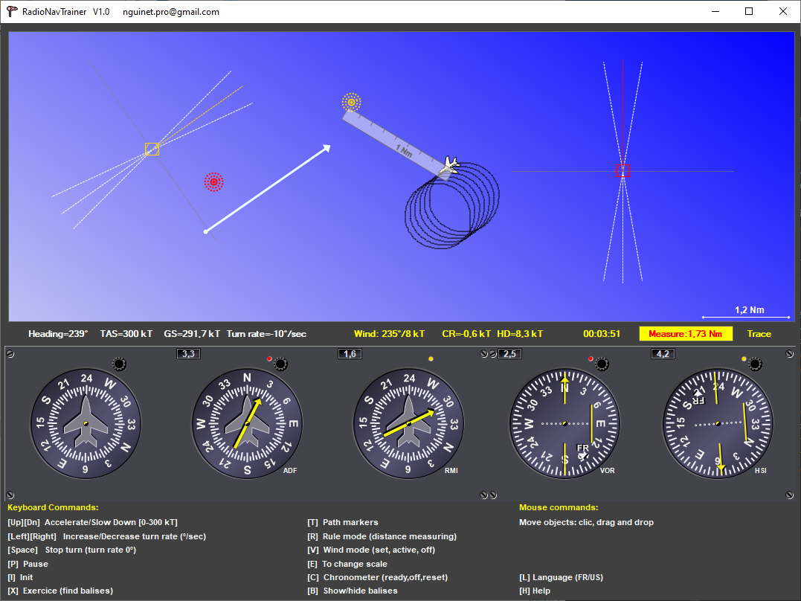

# RadioNavTrainer

C# Winforms application to train pilots to use radionavigation aids for aeronautical activities.

## Compilation

Open the solution in Visual Studio.
Press F5

## Usage

***Rule: Pass over nav aids (to see them press [B])***

- Press [X] to start an exercice (randomize nav aids position): 
- Press [↑] to accelerate
- Navigate with [←][→]. [SPACE] to go straight
- Press [T] to see plane trace (try to make circle in windy condition...)
- Press [V] to set the wind
- Press [R] to get the ruler

## Contributing

Wow, thanks to contribute to this project!   
New ideas, samples, forks...are welcome.  
So please just fork it, commit, push and send me a pull request to main.  

## License

This project is licensed under the [MIT License](LICENSE)
